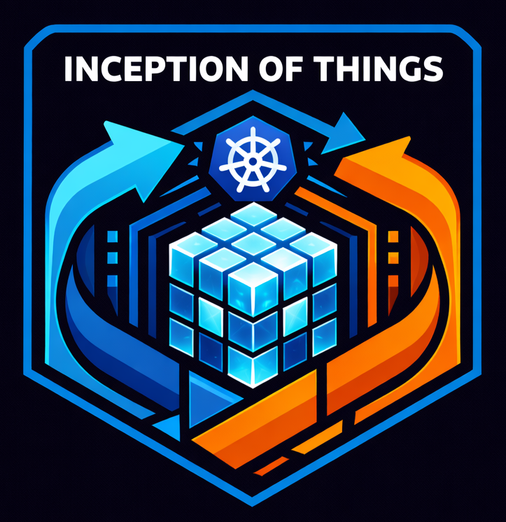

*French version below*
# Hello 👋
Student in DevOps / Cybersecurity, automation and system security, with a growing interest for AI.
Currently preparing for AWS Solutions Architect Associate Certification.

## Hard skills
- **DevOps & Containerization**: Docker, Docker Compose, Kubernetes (K3s, K3d), ArgoCD, GitLab CI/CD, Bash, Linux, virtualization, microservices
- **Monitoring and Observability**: Grafana, Prometheus, ELK Stack
- **Security**: SSL/TLS, system and network security, 2FA, hashing, Vault, tokens
- **Scripting & Automation**: Bash

## Projects
<table align="center">
  <tr>
    <td align="center" width="20%">
      <a href="https://github.com/Christellaa/Inception.git">
        
         
        <strong>Inception</strong>
      </a>
    </td>
    <td align="center" width="20%">
      <a href="https://github.com/Christellaa/transcendence_42.git">
        
         
        <strong>Trancendence</strong>
      </a>
    </td>
    <td align="center" width="20%">
      <a href="https://github.com/Christellaa/Minishell.git">
        
         
        <strong>Minishell</strong>
      </a>
    </td>
    <td align="center" width="20%">
      <a href="https://github.com/Christellaa/InceptionOfThings.git">
        
         
        <strong>Inception Of Things</strong>
      </a>
    </td>
  </tr>
</table>

## Contact
[LinkedIn](https://www.linkedin.com/in/christella-desousa/)

[Portfolio](https://christellaa.github.io/)

# Bonjour 👋
Étudiante en DevOps / Cybersécurité, automatisation et sécurité des systèmes, avec un intérêt croissant pour l’IA.
Actuellement en train de préparer la certification AWS Solutions Architect Associate.

## Hard skills
- **DevOps & conteneurisation**: Docker, Docker Compose, Kubernetes (K3s, K3d), ArgoCD, GitLab CI/CD, Bash, Linux, virtualisation, microservices
- **Monitoring et Observabilité**: Grafana, Prometheus, ELK Stack
- **Sécurité**: SSL/TLS, sécurité système et réseau, 2FA, hashing, Vault, tokens
- **Scripting & Automatisation**: Bash

## Projets
<table align="center">
  <tr>
    <td align="center" width="20%">
      <a href="https://github.com/Christellaa/Inception.git">
        
         
        <strong>Inception</strong>
      </a>
    </td>
    <td align="center" width="20%">
      <a href="https://github.com/Christellaa/transcendence_42.git">
        
         
        <strong>Trancendence</strong>
      </a>
    </td>
    <td align="center" width="20%">
      <a href="https://github.com/Christellaa/Minishell.git">
        
         
        <strong>Minishell</strong>
      </a>
    </td>
    <td align="center" width="20%">
      <a href="https://github.com/Christellaa/InceptionOfThings.git">
        
         
        <strong>Inception Of Things</strong>
      </a>
    </td>
  </tr>
</table>

## Contact
[LinkedIn](https://www.linkedin.com/in/christella-desousa/)

[Portfolio](https://christellaa.github.io/)
